# AI-Backend: Fashion MNIST Classification

**Dibuat oleh: Fathih Apriandi**

## Deskripsi

Project ini adalah implementasi backend sederhana untuk klasifikasi gambar Fashion MNIST menggunakan TensorFlow dan Neural Network. Sistem ini mampu mengenali 10 kategori produk fashion dari gambar grayscale berukuran 28x28 piksel.

Dataset Fashion MNIST merupakan dataset yang berisi 70.000 gambar produk fashion (60.000 untuk training, 10.000 untuk testing) yang dikembangkan oleh Zalando Research sebagai pengganti MNIST yang lebih menantang.

---

## Fitur Utama

- **Training Model**: Melatih neural network dengan arsitektur sederhana namun efektif
- **Testing Otomatis**: Unit testing menggunakan dataset resmi Fashion MNIST
- **Prediksi Custom**: Klasifikasi gambar custom dengan visualisasi hasil
- **Auto-Organize**: Hasil prediksi otomatis dikelompokkan berdasarkan kategori
- **Visualisasi**: Grafik distribusi prediksi untuk analisis hasil

---

## Tech Stack

- **Python 3.12.3**: Bahasa pemrograman utama
- **TensorFlow**: Framework deep learning untuk training dan inferensi model
- **NumPy**: Library untuk manipulasi array dan operasi numerik
- **Pillow (PIL)**: Library untuk pemrosesan dan konversi gambar
- **Matplotlib**: Library untuk visualisasi data dan grafik
- **unittest**: Framework bawaan Python untuk unit testing
- **shutil & os**: Library bawaan untuk manajemen file dan direktori

---

## Struktur Direktori

```
AI-Backend/
│
├── download_image.py              # Script untuk download sample images
├── train_fashion_mnist_model.py   # Script untuk training model
├── predict_custom_image.py        # Script untuk prediksi gambar custom
├── test_model.py                  # Script untuk unit testing model
├── README.md                      # Dokumentasi project
├── fashion_mnist_model.keras      # Model hasil training (generated)
│
├── test-image/                    # Folder input gambar (generated)
│   └── sample_*.png              # 100 gambar sample dari dataset
│
├── result/                        # Folder output klasifikasi (generated)
│   ├── T-shirt_top/
│   ├── Trouser/
│   ├── Pullover/
│   ├── Dress/
│   ├── Coat/
│   ├── Sandal/
│   ├── Shirt/
│   ├── Sneaker/
│   ├── Bag/
│   └── Ankle_boot/
│
└── venv/                          # Virtual environment (optional)
```

---

## Flowchart Overview



---

---

## Alur Kerja Program

### **Tahap 1: Persiapan Data Sample**
Program `download_image.py` mengambil 100 gambar acak dari dataset Fashion MNIST (gabungan training + testing) dan menyimpannya ke folder `test-image/` dalam format PNG.

### **Tahap 2: Training Model**
Program `train_fashion_mnist_model.py` melatih model neural network dengan arsitektur:
- **Input Layer**: Flatten 28x28 piksel menjadi 784 neuron
- **Hidden Layer**: Dense layer dengan 512 neuron dan aktivasi ReLU
- **Output Layer**: Dense layer dengan 10 neuron (10 kelas) dan aktivasi Softmax

Model dilatih selama 10 epoch menggunakan optimizer Adam dan loss function Sparse Categorical Crossentropy. Hasil training disimpan sebagai `fashion_mnist_model.keras`.

### **Tahap 3: Testing & Validasi**

#### **Opsi 1: Testing Otomatis (Unit Test)**
Program `test_model.py` melakukan validasi model menggunakan 10.000 gambar test resmi dari Fashion MNIST. Testing mencakup:
- Evaluasi akurasi dan loss model
- Validasi output prediksi (shape dan probabilitas)
- Memastikan semua output berada dalam range [0, 1]

#### **Opsi 2: Prediksi Manual (Custom Image)**
Program `predict_custom_image.py` memprediksi gambar-gambar di folder `test-image/` dengan alur:
1. Membaca setiap gambar dan mengkonversi ke grayscale 28x28
2. Normalisasi pixel values ke range [0, 1]
3. Melakukan prediksi menggunakan model
4. Menyimpan hasil ke subfolder sesuai label prediksi
5. Menampilkan confidence score di terminal
6. Membuat visualisasi distribusi prediksi

---

## Cara Instalasi

### 1. Clone Repository
```bash
git clone https://github.com/Fathandi/Cita2-Ingin-Menjadi-AI.git
```

### 2. Buat Virtual Environment (Opsional tapi Direkomendasikan)
```bash
# Linux/Mac
python3 -m venv venv
source venv/bin/activate

# Windows
python -m venv venv
venv\Scripts\activate
```

### 3. Install Dependencies
```bash
pip install tensorflow pillow matplotlib numpy
```

### 4. Verifikasi Instalasi
```bash
python -c "import tensorflow as tf; print(tf.__version__)"
```

---

## Cara Penggunaan

### Step 1: Download Gambar Sample
```bash
python download_image.py
```
**Output**: 100 gambar sample tersimpan di folder `test-image/`

---

### Step 2: Training Model
```bash
python train_fashion_mnist_model.py
```
**Output**: Model `fashion_mnist_model.keras` tersimpan di root directory

**Catatan**: 
- Proses training memakan waktu sekitar 2-5 menit tergantung spesifikasi komputer
- Akurasi yang diharapkan: ~88-90% pada epoch terakhir

---

### Step 3: Testing Model

#### **Opsi A: Unit Testing (Otomatis)**

Untuk testing cepat:
```bash
python -m unittest test_model.py
```

Untuk testing dengan coverage report:
```bash
pip install coverage
coverage run -m unittest test_model.py
coverage report
```

**Output**: 
- Status PASS/FAIL untuk setiap test case
- Informasi akurasi dan loss model pada test dataset

---

#### **Opsi B: Prediksi Custom Image (Manual)**

1. **Siapkan Gambar Custom**
   - Format: PNG, JPG, atau JPEG
   - Ukuran: Bebas (akan di-resize otomatis ke 28x28)
   - Tipe: Grayscale atau RGB (akan dikonversi ke grayscale)
   - Simpan di folder `test-image/`

2. **Jalankan Prediksi**
   ```bash
   python predict_custom_image.py
   ```

3. **Hasil Output**
   - Terminal menampilkan prediksi + confidence score untuk setiap gambar
   - Gambar otomatis dipindahkan ke subfolder sesuai prediksi di `result/`
   - Grafik distribusi prediksi ditampilkan otomatis

**Contoh Output Terminal**:
```
sample_1.png: Sneaker (95.34%)
sample_2.png: T-shirt/top (88.21%)
sample_3.png: Bag (92.67%)
...
✅ Semua gambar sudah diklasifikasikan ke folder 'result/'
```

---

## Kategori Fashion MNIST

Model dapat mengenali 10 kategori berikut:

| Index | Label | Deskripsi |
|-------|-------|-----------|
| 0 | T-shirt/top | Kaos dan atasan casual |
| 1 | Trouser | Celana panjang |
| 2 | Pullover | Sweater/cardigan |
| 3 | Dress | Gaun |
| 4 | Coat | Jaket/mantel |
| 5 | Sandal | Sandal |
| 6 | Shirt | Kemeja |
| 7 | Sneaker | Sepatu kets |
| 8 | Bag | Tas |
| 9 | Ankle boot | Sepatu boot |

---

## Arsitektur Model

```
Model: "sequential"
_________________________________________________________________
Layer (type)                Output Shape              Param #   
=================================================================
flatten (Flatten)           (None, 784)               0         
dense (Dense)               (None, 512)               401,920   
dense_1 (Dense)             (None, 10)                5,130     
=================================================================
Total params: 407,050
Trainable params: 407,050
Non-trainable params: 0
```

**Penjelasan**:
- **Flatten Layer**: Mengubah input 2D (28x28) menjadi 1D (784)
- **Hidden Layer**: 512 neuron dengan aktivasi ReLU untuk feature extraction
- **Output Layer**: 10 neuron dengan softmax untuk klasifikasi probabilistik

---

## Tips & Troubleshooting

### Hasil Prediksi Kurang Akurat?
- Pastikan gambar mirip dengan style Fashion MNIST (simple, centered, black background)
- Gambar harus fokus pada satu item fashion
- Hindari gambar dengan background kompleks atau multiple objects

### Error saat Training?
- Pastikan TensorFlow terinstall dengan benar
- Untuk GPU support, install `tensorflow-gpu` dan CUDA toolkit
- Cek RAM tersedia (minimal 4GB recommended)

### Model Tidak Ditemukan?
- Pastikan sudah menjalankan `train_fashion_mnist_model.py` terlebih dahulu
- Cek file `fashion_mnist_model.keras` ada di root directory

---

## Performance Metrics

Berdasarkan testing pada dataset resmi:
- **Akurasi Training**: ~90%
- **Akurasi Testing**: ~88%
- **Loss**: ~0.3
- **Training Time**: 2-5 menit (CPU), <1 menit (GPU)

---

## Future Improvements

- [ ] Implementasi Convolutional Neural Network (CNN) untuk akurasi lebih tinggi
- [ ] Data augmentation untuk training
- [ ] Web interface dengan Flask/FastAPI
- [ ] Real-time prediction via webcam
- [ ] Export model ke TensorFlow Lite untuk mobile deployment
- [ ] Implementasi transfer learning dengan pre-trained models

---

## Lisensi & Kontribusi

**Presented by Fathih Apriandi**

Project ini dibuat untuk keperluan pembelajaran dan riset. Anda bebas menggunakan, memodifikasi, dan mendistribusikan kode ini dengan mencantumkan kredit kepada pembuat asli.

Untuk kontribusi, silakan fork repository dan submit pull request.

---

## Kontak

Jika ada pertanyaan atau saran, silakan hubungi melalui:
- GitHub: [@Fathandi](https://github.com/Fathandi)
- Repository: [Cita2-Ingin-Menjadi-AI](https://github.com/Fathandi/Cita2-Ingin-Menjadi-AI)

---

**Last Updated**: Oktober 2025